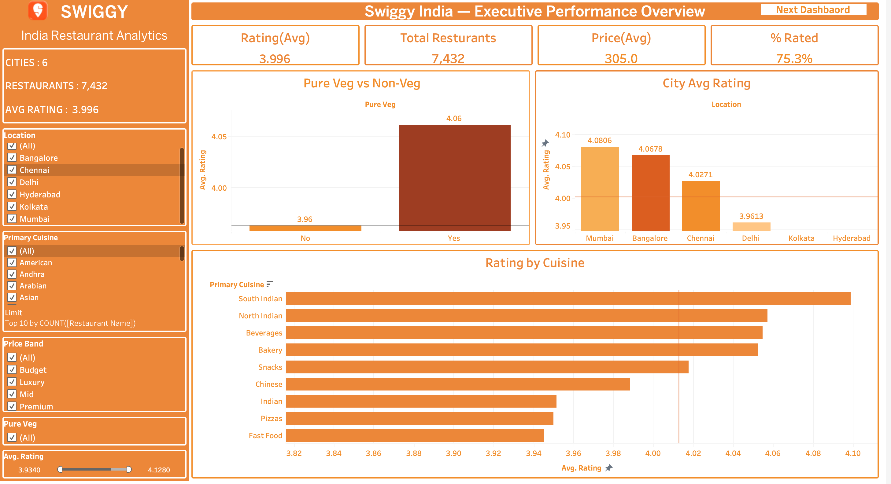
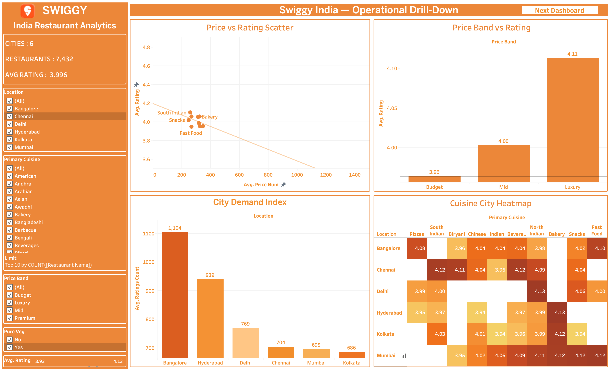
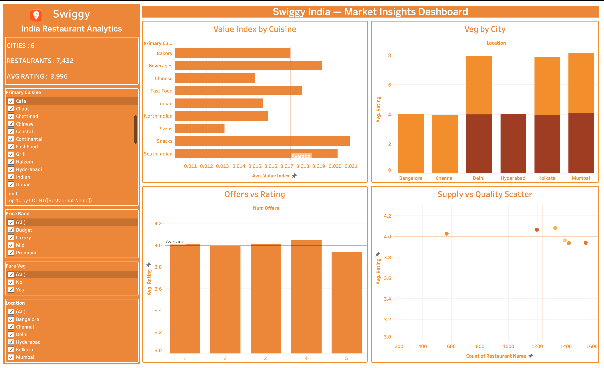

<h1>Swiggy India Restaurant Analytics Dashboard</h1>

Data-driven analysis of restaurant performance across major Indian cities to identify
key drivers of ratings, demand patterns, and strategic market opportunities.

<h2>Overview</h2>

This project analyzes 9,000+ restaurant listings across six Indian cities to understand
how cuisine, pricing, and location influence customer ratings and business performance.

<ul>
<li>Dataset link: <a href="https://www.kaggle.com/datasets/rrkcoder/swiggy-restaurants-dataset/data">Kaggle dataset link</a></li>
<li>6 Indian Cities</li >
<li>7,432 Restaurants</li>
<li>Average Rating: 3.996</li>
<li>Average Price for Two: Rs 305</li>
<li>Rated Restaurants: 75%+</li>
</ul>

<h2>Key Insight</h2>

Restaurant success is primarily driven by <strong>strategic positioning</strong> rather than pricing or promotions.
Cuisine type, city-level demand, and veg preference have a stronger impact on ratings.

<h2>Project Structure</h2>

<pre>
data/
  raw_data/
  processed/

notebooks/
  01_extraction.ipynb
  02_cleaning.ipynb
  03_eda.ipynb
  04_statistical_analysis.ipynb
  05_final_load_prep.ipynb

docs/
  data_dictionary.md

reports/

tableau/
  executive_dashboard.png
  operational_dashboard.png
  market_dashboard.png

README.md
requirements.txt
</pre>

<h2>Tools & Technologies</h2>
<ul>
<li>Python (Pandas, NumPy)</li>
<li>Jupyter Notebook</li>
<li>Tableau Public</li>
</ul>

<h2>Dashboards</h2>

<a href="https://public.tableau.com/app/profile/pratiti.paul/viz/SwiggyAnalysis_17773931032380/ExecutiveDashboard">
View Interactive Dashboard on Tableau
</a>

<h3>Executive Performance Overview Dashboard</h3>

<h3>Operational Drill-Down Dashboard</h3>

<h3>Market Insights Dashboard</h3>

<h2>Key Findings</h2>
<ul>
<li>Cuisine is the strongest driver of ratings</li>
<li>Price has weak correlation with customer satisfaction</li>
<li>Offers do not significantly impact ratings</li>
<li>Pure veg restaurants perform slightly better</li>
<li>Demand-supply gaps exist across city-cuisine combinations</li>
</ul>

<h2>Team</h2>
<ul>
<li>Pratiti Paul</li>
<li>Satvik Prasad</li>
<li>Krishiv</li>
<li>Aarush Gupta</li>
<li>Utkarsh</li>
<li>Ravichandra Shinde</li>
</ul>

<h2>License</h2>

For academic use only.

